# Sprawozdanie z projektu — Sklep Sportowy "Dekalton"

**Temat projektu:** Internetowy sklep sportowy Dekalton

---

## 0. Metryczka

| Pole | Wartość |
|------|---------|
| Uczelnia | Politechnika Białostocka |
| Wydział | Informatyki |
| Kierunek studiów | Informatyka |
| Przedmiot | Inżynieria oprogramowania |
| Rok studiów | II rok |
| Semestr studiów | semestr letni 2025/2026 |
| Prowadzący zajęcia | mgr Bruno Mirčevski |
| Data przekazania sprawozdania | _xx-xx-xxxx_ |

### 0.1 Skład zespołu i podział pracy

**Liczba członków zespołu:** 3

| # | Imię i nazwisko | Rola w zespole | Zakres odpowiedzialności / wkład w projekt |
|---|----------------|----------------|--------------------------------------------|
| 1 | Kacper S. | członek zespołu | wspólne opracowanie wszystkich sekcji sprawozdania |
| 2 | Kacper H. | członek zespołu | wspólne opracowanie wszystkich sekcji sprawozdania |
| 3 | Szymon N. | członek zespołu | wspólne opracowanie wszystkich sekcji sprawozdania |

> _Na obecnym etapie projektu (analiza wymagań — punkty 1–3) prace prowadzone są wspólnie przez wszystkich członków zespołu. Szczegółowy podział obowiązków zostanie doprecyzowany w kolejnych fazach projektu (projekt techniczny, implementacja, testy)._

### 0.2 Proponowana punktacja

| Podpunkt sprawozdania | Proponowana liczba punktów |
|-----------------------|----------------------------|
| 1. Treść zadania projektowego | _x pkt_ |
| 2. Cel, zakres, kontekst, korzyści mierzalne i niemierzalne | _x pkt_ |
| 3. Słownik | _x pkt_ |
| **Razem** | **_<suma>_ pkt** |

### 0.3 Repozytorium projektu

| Pole | Wartość |
|------|---------|
| Adres publiczny repozytorium | _https://github.com/papniaczek/Dekalton_ |
| System kontroli wersji | _GitHub_ |
| Widoczność | _publiczne_ |
| Sposób uzyskania dostępu | _dostęp publiczny — wystarczy otworzyć link_ |
| Główna gałąź (branch) | _main_ |
| Lokalizacja sprawozdania w repo | _/sprawozdanie/sprawozdanie.md_ |

---

## 1. Treść zadania projektowego

Przedmiotem projektu jest zaprojektowanie i wytworzenie internetowego sklepu sportowego o nazwie **Dekalton**, na wzór sklepu Decathlon. System ma postać aplikacji webowej dostępnej dla trzech grup użytkowników:

- **gości** (niezarejestrowanych klientów),
- **zarejestrowanych klientów** (osób prywatnych),
- **administratorów** (pracowników sklepu).

System Dekalton obejmuje następujące moduły funkcjonalne:

- prezentację katalogu produktów sportowych pogrupowanych według dyscyplin sportowych (np. piłka nożna, bieganie, kolarstwo, fitness, sporty wodne, sporty zimowe) wraz z wariantami produktów (rozmiar, kolor, płeć, wiek docelowy);
- mechanizm wyszukiwania i filtrowania produktów po cechach takich jak dyscyplina, kategoria, marka, cena, rozmiar, kolor, ocena;
- koszyk zakupowy oraz proces składania zamówień (checkout) z wyborem metody dostawy i płatności;
- obsługę płatności online za pośrednictwem zewnętrznego operatora płatniczego (BLIK, karta, szybki przelew, płatność przy odbiorze);
- zarządzanie kontem klienta (rejestracja, logowanie, dane adresowe, historia zamówień, lista życzeń);
- panel administracyjny służący do zarządzania produktami, kategoriami, cenami, stanami magazynowymi, promocjami i kuponami rabatowymi;
- moduł opinii i recenzji produktów wystawianych przez klientów po zakupie i dostawie towaru;
- obsługę zwrotów towaru w ustawowym terminie 14 dni od daty dostawy.

---

## 2. Cel, zakres, kontekst oraz korzyści z wdrożenia systemu

### 2.1 Cel systemu

Celem Systemu Dekalton jest udostępnienie klientom indywidualnym kanału sprzedaży internetowej sprzętu sportowego, który umożliwia samodzielne wyszukanie, porównanie i zakup produktów sportowych z dostawą do domu lub do paczkomatu, a właścicielowi sklepu — prowadzenie sprzedaży 24/7 bez konieczności obsługi klienta w sklepie stacjonarnym.

### 2.2 Zakres systemu

Zakres funkcjonalny Systemu Dekalton obejmuje:

- **Front-end klienta:** katalog, wyszukiwarka, karta produktu, koszyk, checkout, konto klienta, opinie, formularz zwrotu.
- **Back-end administracyjny:** zarządzanie produktami, wariantami, kategoriami, stanami magazynowymi, cenami, promocjami, zamówieniami, zwrotami, recenzjami.
- **Integracje zewnętrzne:** bramka płatnicza, operator dostawy, system pocztowy do powiadomień transakcyjnych.
- **Magazyn danych:** baza produktów, klientów, zamówień, opinii, zwrotów.

### 2.3 Kontekst biznesowy

Polski rynek e-commerce sprzętu sportowego rośnie corocznie i jest zdominowany przez kilku dużych graczy. Dekalton wchodzi na ten rynek jako nowy gracz oferujący szeroki wybór dyscyplin sportowych w jednym miejscu.

**Klienci docelowi:**

- amatorzy uprawiający sport rekreacyjnie (osoby 18–55 lat);
- rodzice kupujący sprzęt dla dzieci;
- początkujący sportowcy poszukujący kompletnego wyposażenia.

**Skala eksploatacji (założenie projektowe):** rolę administracyjną pełni 2–5 pracowników; w pierwszym roku działalności przewiduje się ok. 10 000 zarejestrowanych klientów.

### 2.4 Korzyści mierzalne z wdrożenia systemu

Każda korzyść jest opisana wartością docelową oraz sposobem wyliczenia. Wskaźniki są mierzone w okresie 12 miesięcy od wdrożenia, jeżeli nie podano inaczej.

| # | Korzyść | Wartość docelowa | Sposób wyliczenia |
|---|---------|-----------------|-------------------|
| K1 | Wzrost przychodu ze sprzedaży online | +30% rok do roku | (Przychód_rok_2 − Przychód_rok_1) / Przychód_rok_1 × 100%, gdzie przychód = suma wartości brutto zamówień ze statusem "zrealizowane" w danym okresie |
| K2 | Współczynnik konwersji w sklepie | ≥ 2,5% | liczba zamówień złożonych / liczba unikalnych sesji × 100%, mierzony miesięcznie w narzędziu analitycznym |
| K3 | Średnia wartość koszyka (AOV) | ≥ 220 PLN | suma wartości brutto zamówień / liczba zamówień, mierzona miesięcznie |
| K4 | Współczynnik porzucenia koszyka | ≤ 65% | (liczba koszyków utworzonych − liczba koszyków zakończonych zamówieniem) / liczba koszyków utworzonych × 100% |
| K5 | Czas wczytania strony katalogu (LCP) | ≤ 2,5 s dla 75. percentyla | pomiar Largest Contentful Paint w narzędziu Web Vitals na próbie min. 1000 sesji tygodniowo |
| K6 | Średni czas obsługi zwrotu | ≤ 5 dni roboczych | średnia różnica (data_akceptacji_zwrotu − data_zgłoszenia_zwrotu) liczona w dniach roboczych |
| K7 | Wskaźnik powracających klientów | ≥ 25% | liczba klientów z ≥ 2 zamówieniami w okresie / liczba wszystkich klientów z ≥ 1 zamówieniem × 100% |
| K8 | Średnia ocena produktów | ≥ 4,2 / 5,0 | średnia arytmetyczna ocen wystawionych przez klientów w okresie |
| K9 | Dostępność systemu (uptime) | ≥ 99,5% | (czas_całkowity − czas_niedostępności) / czas_całkowity × 100%, mierzony przez monitoring zewnętrzny |

### 2.5 Korzyści niemierzalne z wdrożenia systemu

- Wzmocnienie wizerunku marki Dekalton jako nowoczesnego sprzedawcy sprzętu sportowego.
- Zwiększenie zadowolenia klientów dzięki dostępności sklepu 24/7 oraz przejrzystej prezentacji produktów.
- Łatwiejszy dostęp do sprzętu sportowego dla mieszkańców miejscowości bez sklepów stacjonarnych.
- Lepsze decyzje zakupowe klientów dzięki recenzjom innych użytkowników.
- Uproszczenie pracy administratorów dzięki zintegrowanemu panelowi zarządzania.
- Większa elastyczność w prowadzeniu akcji marketingowych (kupony, promocje sezonowe) bez angażowania pracowników sklepu stacjonarnego.

---

## 3. Słownik pojęć

Słownik definiuje terminy specyficzne dla dziedziny projektu, używane w pozostałych częściach dokumentacji. Pisownia z podkreśleniem (np. *Wariant_Produktu*) oznacza, że termin jest używany jako pojęcie modelu dziedziny.

| Termin | Definicja |
|--------|-----------|
| **System / System Dekalton** | aplikacja webowa będąca przedmiotem niniejszego projektu, składająca się z front-endu klienta i panelu administracyjnego. |
| **Gość** | użytkownik korzystający z Systemu bez założonego konta (nie jest zalogowany). |
| **Klient** | zarejestrowany użytkownik Systemu posiadający konto, mogący składać zamówienia we własnym imieniu. |
| **Administrator** | pracownik sklepu posiadający uprawnienia do zarządzania zawartością Systemu (produkty, zamówienia, recenzje, zwroty). |
| **Produkt** | artykuł sportowy dostępny w sprzedaży, opisany nazwą, marką, kategorią, opisem, zdjęciami i ceną bazową. |
| **Wariant_Produktu** | konkretna odmiana Produktu różniąca się rozmiarem, kolorem, płcią lub wiekiem docelowym; każdy Wariant_Produktu posiada osobny SKU oraz własny stan magazynowy. |
| **SKU (Stock Keeping Unit)** | unikalny alfanumeryczny identyfikator Wariantu_Produktu używany do śledzenia stanu magazynowego. |
| **Kategoria_Sportu** | grupa produktów związanych z konkretną dyscypliną sportową (np. "Piłka nożna", "Bieganie", "Kolarstwo"). |
| **Kategoria_Produktu** | hierarchiczna grupa Produktów (np. "Obuwie", "Odzież", "Akcesoria"), niezależna od Kategorii_Sportu. |
| **Marka** | producent Produktu (własna marka Dekalton lub marka zewnętrzna). |
| **Katalog** | zbiór wszystkich aktywnych Produktów wystawionych na sprzedaż w Systemie. |
| **Karta_Produktu** | ekran prezentujący szczegóły jednego Produktu wraz z dostępnymi Wariantami_Produktu, zdjęciami, ceną i sekcją Recenzji. |
| **Koszyk** | tymczasowa lista wybranych Wariantów_Produktu wraz z ilościami, przypisana do sesji Gościa lub konta Klienta. |
| **Zamówienie** | utrwalona transakcja zakupu zawierająca pozycje, dane dostawy, metodę płatności, status oraz wartość; identyfikowana unikalnym numerem zamówienia. |
| **Status_Zamówienia** | stan Zamówienia w cyklu jego życia, przyjmujący jedną z wartości: NOWE, OPŁACONE, W_REALIZACJI, WYSŁANE, DOSTARCZONE, ANULOWANE, ZWRÓCONE. |
| **Checkout** | proces finalizacji zakupu obejmujący wybór adresu dostawy, sposobu dostawy, metody płatności i potwierdzenie zamówienia. |
| **Bramka_Płatnicza** | zewnętrzny operator płatności online (np. Przelewy24, Stripe), z którym System komunikuje się w celu obsługi transakcji. |
| **Stan_Magazynowy** | liczba sztuk danego Wariantu_Produktu fizycznie dostępnych do sprzedaży. |
| **Recenzja** | pisemna opinia Klienta o Produkcie zawierająca ocenę liczbową w skali 1–5 oraz opcjonalny komentarz. |
| **Zwrot** | proces oddania zakupionego Produktu w terminie ustawowym (14 dni), prowadzący do zwrotu środków na rzecz Klienta. |
| **Lista_Życzeń** | lista Produktów zapisanych przez Klienta do późniejszego rozważenia (bez rezerwacji magazynowej), o maksymalnym rozmiarze 200 pozycji. |
| **Promocja** | czasowe obniżenie ceny Produktu lub grupy Produktów, opisane datą rozpoczęcia, datą zakończenia oraz wartością rabatu (procentową lub kwotową). |
| **Kupon_Rabatowy** | kod alfanumeryczny umożliwiający zastosowanie rabatu na Zamówienie podczas Checkoutu. |
| **Adres_Dostawy** | dane adresowe wskazane przez Klienta jako miejsce dostarczenia Zamówienia. |
| **Kurier** | zewnętrzny operator logistyczny realizujący dostawę Zamówienia (np. InPost, DPD). |

---

## 4. Perspektywa przypadków użycia

### 4.1 Diagramy przypadków użycia

#### 4.1.1 Aktorzy

W Systemie Dekalton wyróżniamy następujących aktorów:

**Aktorzy ludzcy:**

- **Gość** — niezarejestrowany użytkownik Systemu. Ma dostęp do publicznej części sklepu: przeglądania Katalogu, wyszukiwania Produktów, dodawania Produktów do Koszyka oraz złożenia Zamówienia bez rejestracji konta. Nie może wystawiać Recenzji ani prowadzić Listy_Życzeń.
- **Klient** — zarejestrowany użytkownik Systemu posiadający konto. Dziedziczy wszystkie uprawnienia Gościa, a dodatkowo: zarządza danymi konta, prowadzi Listę_Życzeń, przegląda historię Zamówień, wystawia Recenzje (po dostawie zakupionego Produktu) oraz zgłasza Zwroty w terminie 14 dni od dostawy.
- **Administrator** — pracownik sklepu zarządzający zawartością Systemu. Tworzy i edytuje Produkty, Warianty_Produktu, Kategorie, Promocje i Kupony_Rabatowe, moderuje Recenzje, obsługuje Zamówienia (zmiana Statusu_Zamówienia, dodanie numeru przesyłki) oraz akceptuje lub odrzuca zgłoszone Zwroty.

**Aktorzy systemowi (zewnętrzni):**

- **Bramka_Płatnicza** — zewnętrzny system obsługujący płatności online (BLIK, karta, szybki przelew). Komunikuje się z Systemem podczas Checkoutu (autoryzacja transakcji) oraz przy realizacji zwrotu środków po akceptacji Zwrotu.
- **System_Pocztowy** — zewnętrzny system wysyłki wiadomości e-mail (potwierdzenia rejestracji, potwierdzenia Zamówień, powiadomienia o statusie wysyłki, powiadomienia o moderacji Recenzji, formularze Zwrotu).

#### 4.1.2 Lista przypadków użycia

Zidentyfikowano 15 przypadków użycia pogrupowanych w pięć obszarów funkcjonalnych:

| ID | Przypadek użycia | Aktor główny | Aktorzy wspierający |
|----|------------------|--------------|---------------------|
| UC-01 | Przeglądanie Katalogu | Gość, Klient | — |
| UC-02 | Wyszukiwanie i filtrowanie Produktów | Gość, Klient | — |
| UC-03 | Zarządzanie Koszykiem | Gość, Klient | — |
| UC-04 | Złożenie Zamówienia (Checkout) | Klient (lub Gość) | Bramka_Płatnicza, System_Pocztowy |
| UC-05 | Opłacenie Zamówienia | Klient (lub Gość) | Bramka_Płatnicza, System_Pocztowy |
| UC-06 | Rejestracja konta Klienta | Gość | System_Pocztowy |
| UC-07 | Logowanie do Systemu | Klient, Administrator | — |
| UC-08 | Zarządzanie kontem (dane, adresy, Lista_Życzeń) | Klient | — |
| UC-09 | Wystawienie Recenzji | Klient | — |
| UC-10 | Zgłoszenie Zwrotu | Klient | System_Pocztowy, Bramka_Płatnicza |
| UC-11 | Zarządzanie Produktami i Wariantami_Produktu | Administrator | — |
| UC-12 | Zarządzanie Promocjami i Kuponami_Rabatowymi | Administrator | — |
| UC-13 | Obsługa Zamówień (zmiana statusu, wysyłka) | Administrator | System_Pocztowy |
| UC-14 | Moderacja Recenzji | Administrator | System_Pocztowy |
| UC-15 | Akceptacja / odrzucenie Zwrotu | Administrator | Bramka_Płatnicza, System_Pocztowy |

#### 4.1.2 Diagram przypadków użycia

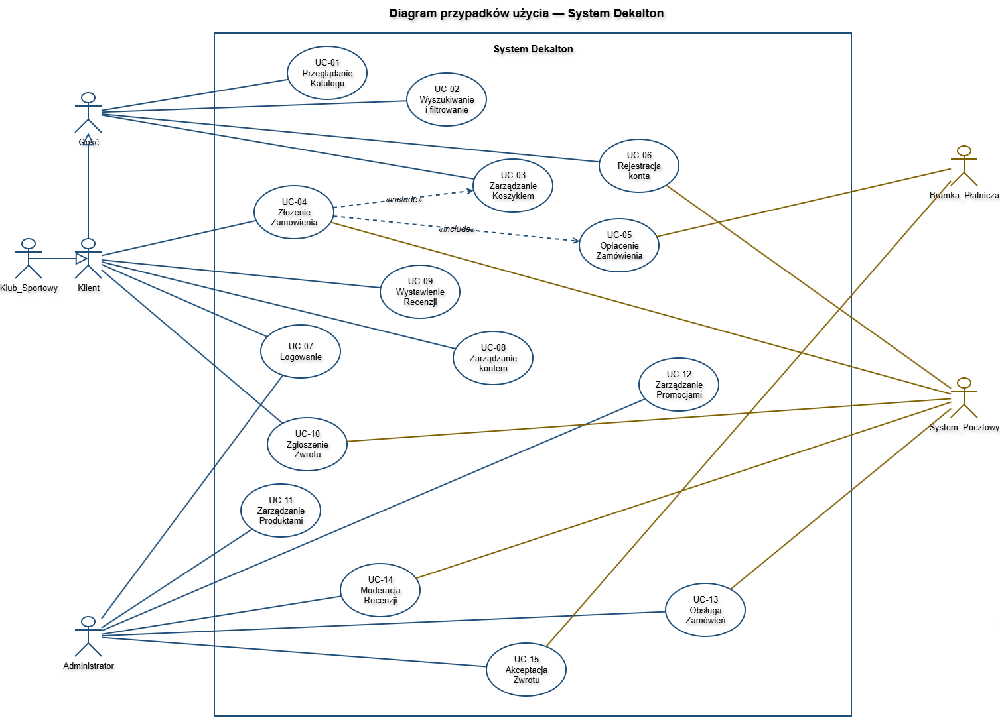

> _Diagram przedstawia wszystkie 15 przypadków użycia z tabeli w punkcie 4.1.2 wraz z powiązaniami z aktorami (Gość, Klient, Administrator, Bramka_Płatnicza, System_Pocztowy). Uwzględnione są relacje dziedziczenia ról (Gość → Klient), relacja «include» (UC-04 Złożenie Zamówienia → UC-05 Opłacenie Zamówienia, UC-04 → UC-03 Zarządzanie Koszykiem) oraz relacja «extend» (UC-15 Akceptacja Zwrotu rozszerza UC-10 Zgłoszenie Zwrotu)._

### 4.1.2 Opisy tekstowe wybranych przypadków użycia

Do szczegółowego opisu wybrano trzy przypadki użycia o najbardziej rozbudowanych przepływach alternatywnych: złożenie Zamówienia, zgłoszenie Zwrotu oraz wystawienie Recenzji.

#### UC-04 Złożenie Zamówienia (Checkout)

**Aktorzy:**

- *Główny:* Klient (lub Gość składający Zamówienie bez rejestracji)
- *Wspierający:* Bramka_Płatnicza, System_Pocztowy

**Warunki początkowe:**

- Klient ma w Koszyku co najmniej jedną pozycję o Stanie_Magazynowym ≥ 1.

**Warunki końcowe (sukces):**

- W Systemie utworzono Zamówienie ze Statusem_Zamówienia "OPŁACONE" lub "NOWE" (dla płatności przy odbiorze).
- Stan_Magazynowy odpowiednich Wariantów_Produktu został pomniejszony.
- Klient otrzymał e-mail z potwierdzeniem.

**Przepływ podstawowy:**

1. Klient wybiera akcję „Przejdź do Checkoutu" w Koszyku.
2. System wyświetla formularz wyboru Adresu_Dostawy.
3. Klient wskazuje Adres_Dostawy (lub wprowadza nowy).
4. System wyświetla dostępne sposoby dostawy (kurier / paczkomat / odbiór osobisty) i wylicza koszt dostawy.
5. Klient wybiera sposób dostawy.
6. System wyświetla dostępne metody płatności.
7. Klient wybiera metodę płatności.
8. System prezentuje podsumowanie Zamówienia (pozycje, koszt dostawy, łączna wartość, opcjonalny Kupon_Rabatowy).
9. Klient potwierdza Zamówienie.
10. System tworzy Zamówienie ze Statusem "NOWE", rezerwuje Stan_Magazynowy i nadaje numer w formacie `DK-{rok}-{numer}`.
11. System przekierowuje Klienta do Bramki_Płatniczej (z parametrami transakcji).
12. Klient finalizuje płatność w Bramce_Płatniczej.
13. Bramka_Płatnicza zwraca status „płatność_zaakceptowana".
14. System ustawia Status_Zamówienia na "OPŁACONE" i zleca System_Pocztowemu wysyłkę e-maila z potwierdzeniem.
15. System wyświetla Klientowi stronę z potwierdzeniem Zamówienia.

**Przepływy alternatywne:**

- **A1. Niedostępność pozycji w Koszyku (krok 9–10):** jeśli pomiędzy rozpoczęciem Checkoutu a potwierdzeniem Stan_Magazynowy któregoś Wariantu_Produktu spadł poniżej ilości w Koszyku, System przerywa Checkout i wyświetla listę pozycji wymagających zmiany. Klient wraca do Koszyka.
- **A2. Płatność odrzucona (krok 13):** Bramka_Płatnicza zwraca „płatność_odrzucona". Status_Zamówienia pozostaje "NOWE", Klient widzi komunikat z przyczyną i może ponowić płatność (do 5 prób).
- **A3. Timeout płatności (krok 12):** Klient nie sfinalizuje płatności w 60 minut od utworzenia Zamówienia. System ustawia Status_Zamówienia "ANULOWANE", zwalnia rezerwację Stanu_Magazynowego i wysyła e-mail informacyjny.
- **A4. Niedostępność Bramki_Płatniczej (krok 11–13):** Bramka_Płatnicza nie odpowiada w 30 sekund. System wyświetla komunikat o tymczasowej niedostępności i pozwala wybrać inną metodę płatności bez utraty danych Zamówienia.
- **A5. Płatność przy odbiorze (krok 7):** Klient wybiera „płatność przy odbiorze" — System pomija kroki 11–13, tworzy Zamówienie ze Statusem "NOWE" i przekazuje je do realizacji.
- **A6. Nieprawidłowy Kupon_Rabatowy (krok 8):** kod nie istnieje / wygasł / niespełnione warunki — System odrzuca kupon, zachowuje wartość Zamówienia bez rabatu i informuje Klienta o przyczynie.

**Częstotliwość i czas realizacji:**

- *Częstotliwość typowa:* ok. 200–400 wykonań na dobę (założenie projektowe ~10 000 klientów rocznie, konwersja ≥ 2,5%, średnio ~25 zamówień / dobę × szczyty).
- *Spiętrzenia:* okres przedświąteczny (XI–XII), wyprzedaże sezonowe — wzrost do 4–5× ruchu typowego (≈1500 wykonań / dobę).
- *Typowy czas realizacji:* 3–5 minut od rozpoczęcia Checkoutu do potwierdzenia.
- *Maksymalny czas realizacji:* 60 minut (po tym czasie Zamówienie jest automatycznie anulowane przez System).

**Wartości uzyskane przez aktorów:**

- *Klient:* złożone Zamówienie, potwierdzenie e-mail z numerem Zamówienia i przewidywanym terminem dostawy, prawo do zwrotu w terminie 14 dni.
- *Sklep (właściciel):* nowe przychody, dane do realizacji wysyłki, dane analityczne dla wskaźników K1 (przychód), K2 (konwersja), K3 (AOV).

---

#### UC-10 Zgłoszenie Zwrotu

**Aktorzy:**

- *Główny:* Klient
- *Wspierający:* System_Pocztowy, Bramka_Płatnicza (w fazie akceptacji), Administrator (w UC-15)

**Warunki początkowe:**

- Klient jest zalogowany.
- Istnieje Zamówienie Klienta o Statusie_Zamówienia "DOSTARCZONE".
- Od daty dostawy upłynęło nie więcej niż 14 dni kalendarzowych.

**Warunki końcowe (sukces):**

- Utworzony rekord Zwrotu ze statusem początkowym (przed weryfikacją Administratora).
- Wygenerowany formularz Zwrotu (PDF) udostępniony i wysłany e-mailem.

**Przepływ podstawowy:**

1. Klient otwiera historię Zamówień i wybiera Zamówienie kwalifikujące się do Zwrotu.
2. Klient wybiera akcję „Zgłoś zwrot".
3. System wyświetla pozycje Zamówienia z możliwością wskazania ilości do zwrotu.
4. Klient zaznacza pozycje i ilości (od 1 do liczby zakupionych sztuk).
5. Klient wybiera przyczynę Zwrotu z predefiniowanej listy.
6. Klient potwierdza zgłoszenie.
7. System tworzy rekord Zwrotu i generuje formularz w PDF (≤ 30 s).
8. System udostępnia formularz do pobrania oraz wysyła go e-mailem przez System_Pocztowy (≤ 5 min).
9. System wyświetla Klientowi potwierdzenie zgłoszenia z instrukcją odesłania towaru.

**Przepływy alternatywne:**

- **A1. Termin upłynął (krok 1–2):** od daty dostawy minęło więcej niż 14 dni — System odrzuca zgłoszenie i wyświetla komunikat o upłynięciu terminu, nie tworzy rekordu Zwrotu.
- **A2. Akceptacja Zwrotu przez Administratora (rozszerzenie UC-15):** po fizycznym otrzymaniu towaru Administrator akceptuje Zwrot — System zwiększa Stan_Magazynowy, inicjuje zwrot środków przez Bramkę_Płatniczą (≤ 60 s) i ustawia Status_Zamówienia na "ZWRÓCONE" (lub odnotowuje zwrot częściowy). Klient otrzymuje e-mail.
- **A3. Odrzucenie Zwrotu przez Administratora (rozszerzenie UC-15):** Administrator ocenia stan towaru jako nieakceptowalny (uszkodzenie, brak metki) — System ustawia status Zwrotu na "ODRZUCONY", nie zmienia Stanu_Magazynowego, wysyła e-mail z uzasadnieniem.
- **A4. Błąd Bramki_Płatniczej przy zwrocie środków:** System ponawia operację do 3 razy w odstępach ≥ 24 h i powiadamia Administratora o nieudanej operacji.

**Częstotliwość i czas realizacji:**

- *Częstotliwość typowa:* przy założonym wskaźniku zwrotów ~10% Zamówień: ≈ 20–40 zgłoszeń / dobę.
- *Spiętrzenia:* po sezonowych wyprzedażach i okresie świątecznym (do 100 zgłoszeń / dobę).
- *Typowy czas realizacji (zgłoszenie po stronie Klienta):* 2–4 minuty.
- *Maksymalny czas obsługi całego procesu (do zwrotu środków):* 14 dni kalendarzowych od akceptacji Zwrotu (zgodnie z prawem); operacyjny cel K6 to ≤ 5 dni roboczych do akceptacji.

**Wartości uzyskane przez aktorów:**

- *Klient:* możliwość odzyskania środków zgodnie z ustawowym prawem do zwrotu, formularz PDF, transparentny status procesu.
- *Sklep:* zorganizowany proces obsługi zwrotów, audytowalny stan magazynowy, zgodność z wymogami prawnymi.

---

#### UC-09 Wystawienie Recenzji

**Aktorzy:**

- *Główny:* Klient
- *Wspierający:* Administrator (w UC-14 — moderacja), System_Pocztowy

**Warunki początkowe:**

- Klient jest zalogowany.
- Klient zakupił Produkt w Zamówieniu o Statusie_Zamówienia "DOSTARCZONE".
- Klient nie wystawił jeszcze Recenzji dla tego Produktu w ramach tego Zamówienia.

**Warunki końcowe (sukces):**

- Utworzona Recenzja ze statusem "OCZEKUJĄCA" przekazana do moderacji.

**Przepływ podstawowy:**

1. Klient otwiera Kartę_Produktu (lub historię Zamówień) i wybiera akcję „Wystaw recenzję".
2. System weryfikuje uprawnienie Klienta do wystawienia Recenzji (zakup + Status_Zamówienia "DOSTARCZONE").
3. System wyświetla formularz: ocena 1–5 (wymagana) i komentarz (10–2000 znaków, opcjonalny).
4. Klient wprowadza ocenę i komentarz.
5. Klient zatwierdza Recenzję.
6. System zapisuje Recenzję ze statusem "OCZEKUJĄCA", ukrywa ją na Karcie_Produktu i przekazuje do kolejki moderacji (≤ 72 h).
7. System wyświetla Klientowi potwierdzenie i informuje, że Recenzja oczekuje na moderację.

**Przepływy alternatywne:**

- **A1. Brak uprawnień (krok 2):** Klient nie zakupił Produktu lub Status_Zamówienia inny niż "DOSTARCZONE" — System odrzuca żądanie i wyświetla komunikat „Recenzję mogą wystawiać wyłącznie kupujący tego produktu".
- **A2. Niepoprawny komentarz (krok 5):** komentarz krótszy niż 10 znaków lub dłuższy niż 2000 — System odrzuca zapis, zachowuje wprowadzone dane w formularzu i wyświetla komunikat o dopuszczalnej długości.
- **A3. Zatwierdzenie przez Administratora (UC-14):** Administrator zatwierdza Recenzję — System ustawia status "ZATWIERDZONA", publikuje Recenzję na Karcie_Produktu (≤ 60 s) i przelicza średnią ocenę Produktu.
- **A4. Odrzucenie przez Administratora (UC-14):** Administrator odrzuca Recenzję — System ustawia status "ODRZUCONA" i wysyła Klientowi e-mail z uzasadnieniem (≤ 60 s).
- **A5. Edycja Recenzji w 30 dni (krok 7):** Klient edytuje wcześniej zatwierdzoną Recenzję — System przywraca status "OCZEKUJĄCA", ukrywa ją na Karcie_Produktu i ponownie kieruje do moderacji.

**Częstotliwość i czas realizacji:**

- *Częstotliwość typowa:* ~10–20% klientów wystawia Recenzję — ≈ 30–80 recenzji / dobę.
- *Spiętrzenia:* po dużych kampaniach zakupowych (zwiększenie 2–3×).
- *Typowy czas realizacji (po stronie Klienta):* 1–3 minuty.
- *Maksymalny czas publikacji:* do 72 h (cel moderacji); publikacja po zatwierdzeniu w ciągu 60 s.

**Wartości uzyskane przez aktorów:**

- *Klient (autor):* możliwość podzielenia się opinią, wpływ na decyzje innych Klientów.
- *Inni Klienci:* lepsze decyzje zakupowe (korzyść niemierzalna).
- *Sklep:* materiał marketingowy, dane do wskaźnika K8 (średnia ocena ≥ 4,2 / 5,0), informacja zwrotna o jakości Produktów.

---

### 4.2 Diagramy czynności

W niniejszej sekcji przedstawiono trzy diagramy czynności (UML Activity) z podziałem na swimlanes (tory) odpowiadające aktorom uczestniczącym w przebiegu każdego z procesów. Dla każdego diagramu wybrano przypadek użycia o najbardziej rozbudowanej logice przepływu i przepływach alternatywnych.

#### 4.2.1 UC-04 Złożenie Zamówienia (Checkout)

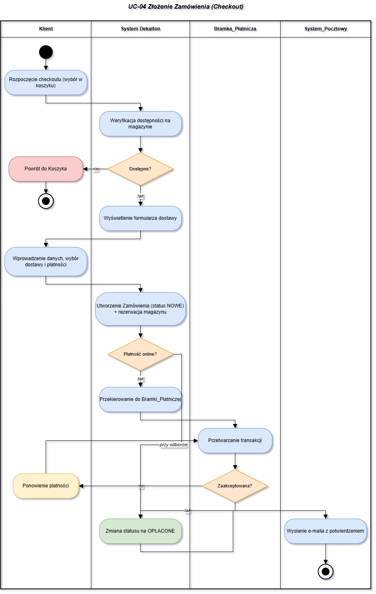

Diagram obejmuje cztery tory: **Klient**, **System Dekalton**, **Bramka_Płatnicza** oraz **System_Pocztowy**. Przepływ rozpoczyna się od rozpoczęcia Checkoutu przez Klienta, po którym System Dekalton weryfikuje dostępność pozycji na magazynie. W diagramie występują trzy punkty decyzyjne: (1) **dostępność pozycji** — w przypadku braku przepływ kończy się powrotem do Koszyka, (2) **wybór metody płatności** — gałąź "przy odbiorze" pomija etap obsługi przez Bramkę_Płatniczą i prowadzi bezpośrednio do zmiany Statusu_Zamówienia na OPŁACONE oraz wysyłki e-maila, (3) **wynik płatności online** — gałąź "odrzucona" tworzy pętlę przez aktywność "Ponowienie płatności" z powrotem do przetwarzania transakcji, gałąź "zaakceptowana" prowadzi do zmiany Statusu_Zamówienia na OPŁACONE, wysyłki potwierdzenia przez System_Pocztowy i węzła końcowego.

#### 4.2.2 UC-10 Zgłoszenie Zwrotu

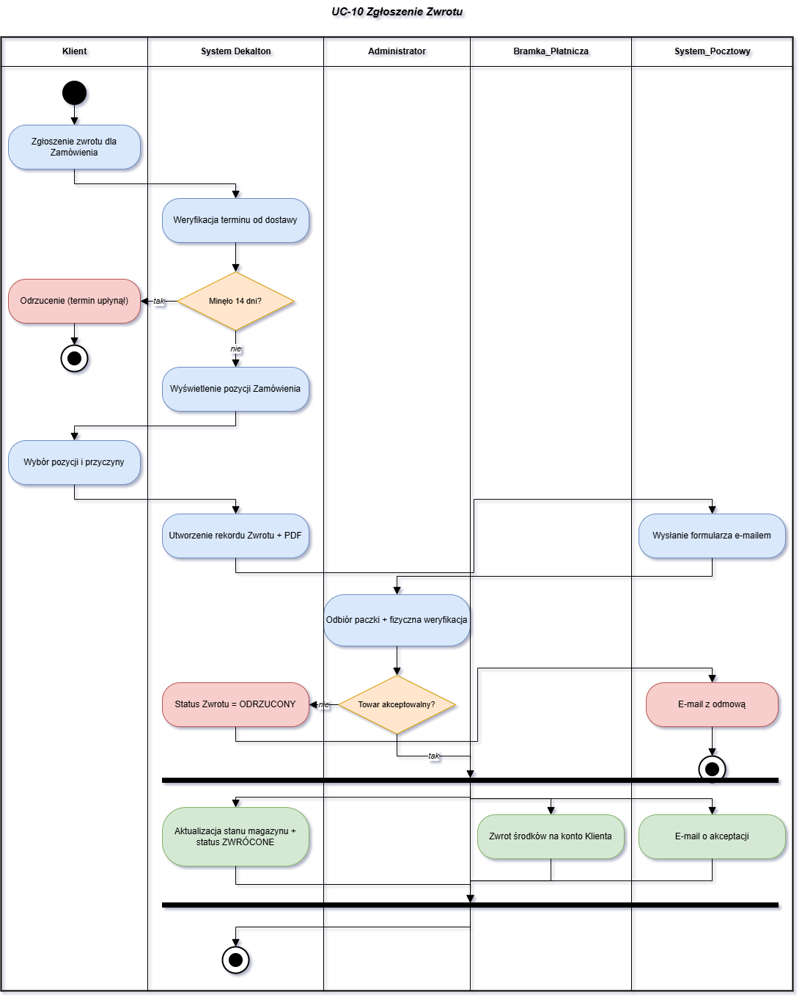

Diagram obejmuje pięć torów: **Klient**, **System Dekalton**, **Administrator**, **Bramka_Płatnicza** oraz **System_Pocztowy**. Po zgłoszeniu Zwrotu przez Klienta System Dekalton weryfikuje termin 14 dni od dostawy — jeśli termin upłynął, przepływ kończy się odrzuceniem. W przeciwnym razie Klient wybiera pozycje i przyczynę Zwrotu, System Dekalton tworzy rekord oraz generuje formularz PDF, a System_Pocztowy wysyła go Klientowi. Administrator po fizycznym odebraniu paczki weryfikuje stan towaru. Punkt decyzyjny "Towar akceptowalny?" rozdziela przepływ na dwie ścieżki: gałąź "nie" prowadzi do statusu ODRZUCONY i e-maila z odmową, gałąź "tak" uruchamia **fork (rozdzielenie równoległe)** — trzy niezależne aktywności wykonywane jednocześnie: aktualizacja stanu magazynowego i Statusu_Zamówienia na ZWRÓCONE w Systemie Dekalton, zwrot środków przez Bramkę_Płatniczą oraz wysłanie e-maila o akceptacji przez System_Pocztowy. Po zakończeniu wszystkich trzech ścieżek **join (połączenie)** sprowadza przepływ do węzła końcowego.

#### 4.2.3 UC-09 Wystawienie Recenzji

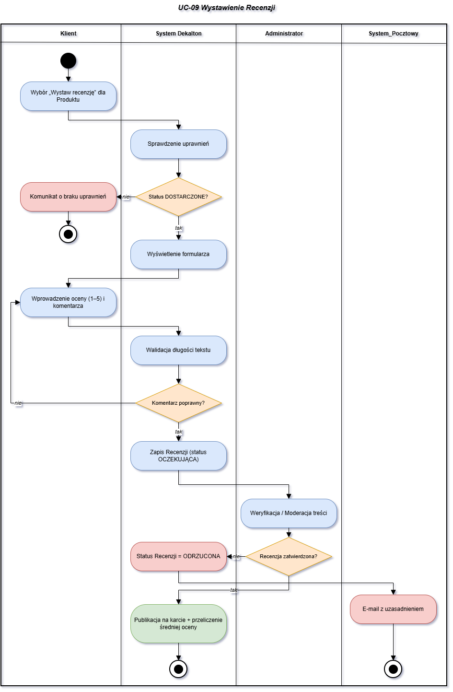

Diagram obejmuje cztery tory: **Klient**, **System Dekalton**, **Administrator** oraz **System_Pocztowy**. Po wybraniu opcji wystawienia Recenzji przez Klienta System Dekalton sprawdza uprawnienia. Punkt decyzyjny "Status_Zamówienia = DOSTARCZONE?" odrzuca przepływ z komunikatem o braku uprawnień, jeżeli warunek nie jest spełniony. W gałęzi "tak" Klient wprowadza ocenę (1-5) i komentarz, a System Dekalton waliduje długość tekstu (10-2000 znaków) — punkt decyzyjny "Komentarz poprawny?" tworzy pętlę z powrotem do wprowadzania oceny i komentarza, jeśli treść nie spełnia wymagań. Po pozytywnej walidacji Recenzja zostaje zapisana ze statusem OCZEKUJĄCA i przekazana Administratorowi do moderacji. Punkt decyzyjny "Recenzja zatwierdzona?" rozdziela przepływ: gałąź "nie" prowadzi do statusu ODRZUCONA i e-maila z uzasadnieniem, gałąź "tak" do publikacji Recenzji na Karcie_Produktu i przeliczenia średniej oceny.

---

### 4.3 Diagramy interakcji (przebiegu) z opisem tekstowym komunikatów

Poniżej przedstawiono trzy wybrane diagramy interakcji (sekwencji) modelujące przebieg komunikatów pomiędzy obiektami systemu. Zastosowano podejście obiektowe, uwzględniając cykl życia obiektów (tworzenie i niszczenie) oraz bloki sterujące (iteracje i warunki).

#### 4.3.1 UC-04 Złożenie Zamówienia

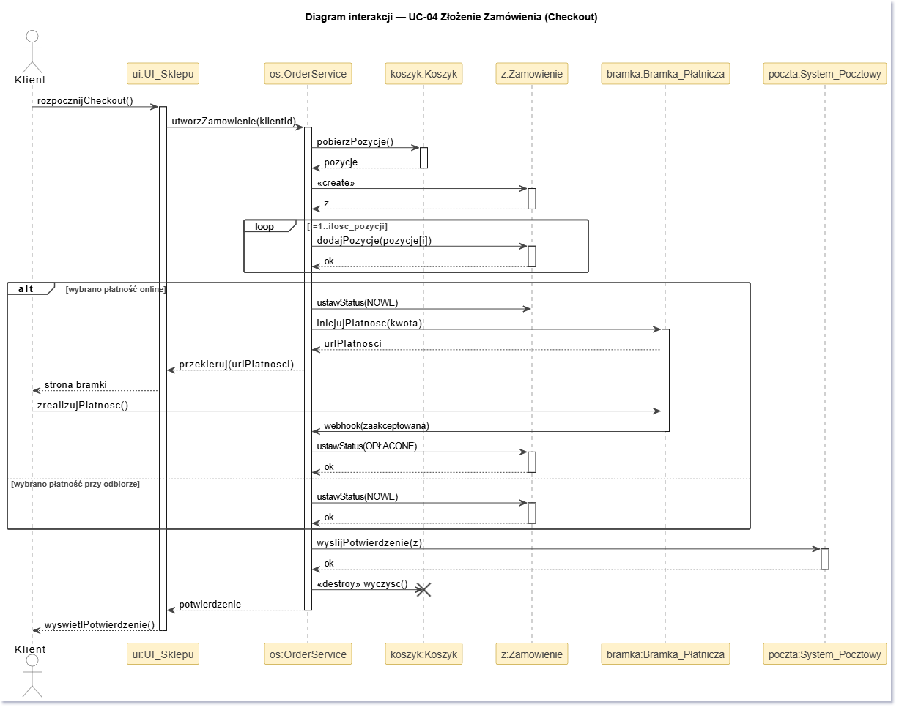

**Uczestniczące obiekty:** aktor Klient, obiekt brzegowy `:UI_Sklepu`, obiekt sterujący `:OrderService`, obiekt encji `koszyk:Koszyk`, obiekt encji `zamowienie:Zamowienie`.

**Opis komunikatów:**

| # | Komunikat | Nadawca → Odbiorca | Opis |
|---|-----------|-------------------|------|
| 1 | `rozpocznijCheckout()` | Klient → :UI_Sklepu | Klient inicjuje proces finalizacji zamówienia w interfejsie. |
| 2 | `utworzZamowienie(klientId)` | :UI_Sklepu → :OrderService | Przekazanie żądania utworzenia zamówienia do warstwy logiki. |
| 3 | `pobierzPozycje()` | :OrderService → koszyk:Koszyk | Pobranie zawartości z obiektu koszyka powiązanego z sesją. |
| 4 | `pozycje` | koszyk:Koszyk → :OrderService | Zwrot listy wybranych wariantów produktów. |
| 5 | `<<create>>` | :OrderService → zamowienie:Zamowienie | Utworzenie nowego, pustego obiektu zamówienia. |
| 6 | `z` | zamowienie:Zamowienie → :OrderService | Zwrócenie referencji do nowo utworzonego obiektu. |
| 7 | `dodajPozycje(pozycje[i])` | :OrderService → zamowienie:Zamowienie | [Pętla: 1..ilosc_pozycji] Cykliczne dodawanie pozycji z koszyka do obiektu zamówienia. |
| 8 | `ustawStatus(OPŁACONE)` | :OrderService → zamowienie:Zamowienie | [Warunek: płatność online] Ustawienie statusu w przypadku opłacenia z góry. |
| 9 | `ustawStatus(NOWE)` | :OrderService → zamowienie:Zamowienie | [Warunek: płatność przy odbiorze] Ustawienie statusu dla pobrania. |
| 10| `<<destroy>> wyczysc()` | :OrderService → koszyk:Koszyk | Usunięcie obiektu koszyka po udanym skopiowaniu danych do zamówienia. |
| 11| `potwierdzenie` | :OrderService → :UI_Sklepu | Zwrot informacji o sukcesie operacji. |
| 12| `wyswietlPotwierdzenie()`| :UI_Sklepu → Klient | Prezentacja ekranu podsumowania. |

---

#### 4.3.2 UC-10 Zgłoszenie Zwrotu

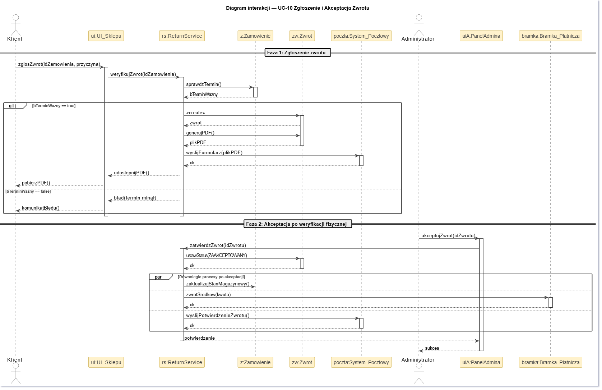

**Uczestniczące obiekty:** aktor Klient, obiekt brzegowy `:UI_Sklepu`, obiekt sterujący `:ReturnService`, obiekt encji `zamowienie:Zamowienie`, obiekt encji `zwrot:Zwrot`.

**Opis komunikatów:**

| # | Komunikat | Nadawca → Odbiorca | Opis |
|---|-----------|-------------------|------|
| 1 | `zglosZwrot(idZamowienia, przyczyna)`| Klient → :UI_Sklepu | Klient wypełnia formularz zwrotu wybranego zamówienia. |
| 2 | `weryfikujZwrot(idZamowienia)` | :UI_Sklepu → :ReturnService | Przekazanie zgłoszenia do walidacji. |
| 3 | `sprawdzTermin(idZamowienia)` | :ReturnService → zamowienie:Zamowienie | Wywołanie na obiekcie zamówienia metody sprawdzającej, czy nie minęło 14 dni od dostawy. |
| 4 | `bTerminWazny` | zamowienie:Zamowienie → :ReturnService | Zwrócenie flagi logicznej oznaczającej ważność terminu. |
| 5 | `<<create>>` | :ReturnService → zwrot:Zwrot | [Opcja: bTerminWazny == true] Utworzenie nowego obiektu reprezentującego zwrot. |
| 6 | `zwrot` | zwrot:Zwrot → :ReturnService | Zwrócenie referencji do obiektu zwrotu. |
| 7 | `generujPDF()` | :ReturnService → zwrot:Zwrot | Zlecenie obiektowi wygenerowania własnego widoku do druku. |
| 8 | `plikPDF` | zwrot:Zwrot → :ReturnService | Zwrócenie wygenerowanego pliku. |
| 9 | `udostepnijPDF()` | :ReturnService → :UI_Sklepu | Przekazanie pliku do warstwy prezentacji. |
| 10| `pobierzPDF()` | :UI_Sklepu → Klient | Udostępnienie pliku Klientowi do pobrania. |

---

#### 4.3.3 UC-09 Wystawienie Recenzji (Przebieg Moderacji)

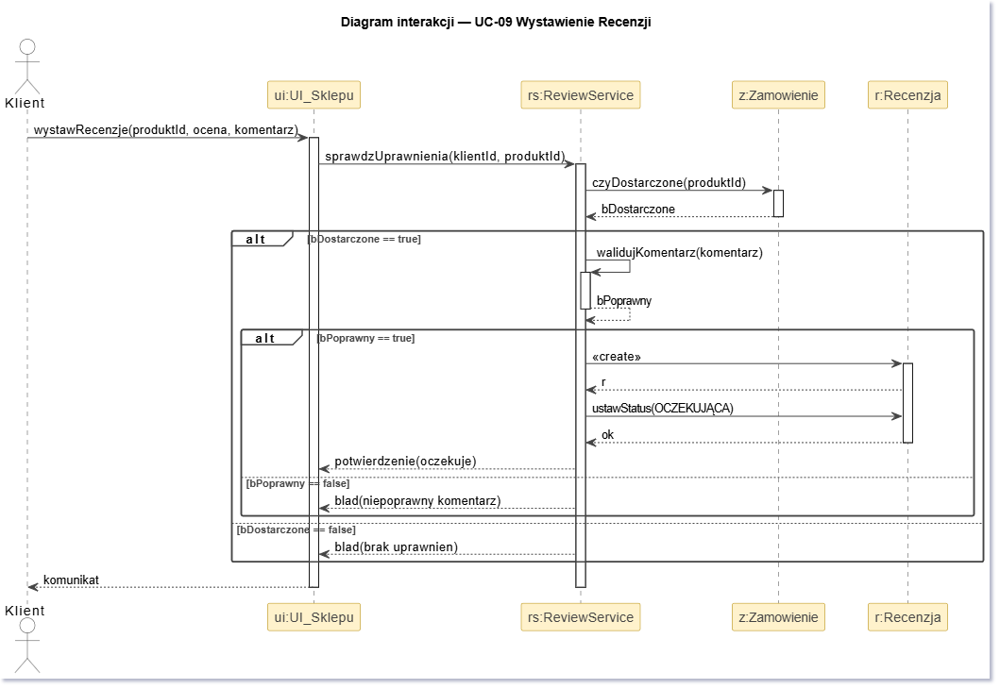

**Uczestniczące obiekty:** aktor Administrator, obiekt brzegowy `:PanelAdmina`, obiekt sterujący `:ReviewService`, obiekt encji `recenzje:KolejkaRecenzji`, obiekt encji `r:Recenzja`.

**Opis komunikatów:**

| # | Komunikat | Nadawca → Odbiorca | Opis |
|---|-----------|-------------------|------|
| 1 | `pobierzOczekujace()` | Administrator → :PanelAdmina | Administrator żąda wyświetlenia listy recenzji do sprawdzenia. |
| 2 | `pobierzDoModeracji()`| :PanelAdmina → :ReviewService | Panel przekazuje żądanie do kontrolera opinii. |
| 3 | `pobierzListe()` | :ReviewService → recenzje:KolejkaRecenzji | Pobranie danych z agregatu przechowującego oczekujące recenzje. |
| 4 | `listaRecenzji` | recenzje:KolejkaRecenzji → :ReviewService | Zwrócenie kolekcji recenzji. |
| 5 | `wyświetlListe()` | :ReviewService → :PanelAdmina | Przekazanie danych na widok administratora. |
| 6 | `ocenRecenzje(r, decyzja)` | Administrator → :PanelAdmina | [Pętla: dla każdej recenzji] Podjęcie decyzji (akceptuj/odrzuć) dla konkretnej recenzji. |
| 7 | `moderuj(r, decyzja)` | :PanelAdmina → :ReviewService | Przekazanie decyzji moderatora do serwisu. |
| 8 | `ustawStatus(ZATWIERDZONA)` | :ReviewService → r:Recenzja | [Warunek: akceptacja] Obiekt recenzji zmienia swój stan wewnętrzny i staje się publiczny. |
| 9 | `<<destroy>> usun()` | :ReviewService → r:Recenzja | [Warunek: odrzucenie] Destrukcja (usunięcie) obiektu niespełniającego regulaminu. |
| 10| `status` | :ReviewService → :PanelAdmina | Zwrócenie wyniku operacji po przetworzeniu każdej z recenzji. |

## 5. Perspektywa projektowa

### 5.0 Proponowana architektura systemu

Architektura systemu Dekalton opiera się na klasycznym, trójwarstwowym modelu aplikacji webowej. Główny nacisk położono na ścisłą separację obowiązków (SoC), co ułatwia testowanie, wdrażanie oraz późniejsze modyfikacje. Logika serwerowa opiera się na technologii .NET (np. ASP.NET Core), a dane składowane są w relacyjnej bazie danych (SQL). 

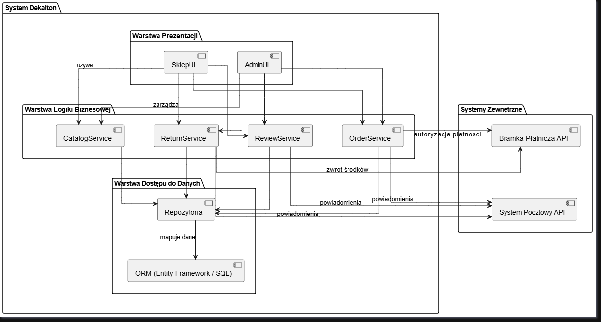

> *Diagram prezentuje logiczny podział systemu na warstwy: Prezentacji, Logiki Biznesowej oraz Dostępu do Danych, a także integracje z wymaganymi systemami zewnętrznymi (Bramka Płatnicza, System Pocztowy).*

**Zidentyfikowane komponenty i pakiety (warstwy):**

1. **Warstwa Prezentacji:**
   * Odpowiada za interfejs użytkownika (UI) i interakcję z aktorem. 
   * Podzielona na dwa główne pakiety: `SklepUI` (sklep docelowy dla Gości i Klientów, m.in. katalog, koszyk, checkout) oraz `AdminUI` (panel zarządzania zawartością dla Administratorów).
   * Komunikuje się z backendem wyłącznie poprzez żądania sieciowe do wystawionego API.

2. **Warstwa Logiki Biznesowej:**
   * Rdzeń systemu w środowisku .NET, w którym zaimplementowano pełne procesy biznesowe. Zawiera usługi (serwisy) hermetyzujące reguły dziedzinowe. Zastosowano tu popularne wzorce projektowe.
   * `OrderService` – nadzoruje cykl życia Zamówienia, płatności i operacje na Koszyku. Wykorzystuje wzorzec *Builder* (Budowniczy) do bezpiecznego konstruowania skomplikowanych obiektów zamówień.
   * `ReviewService` – odpowiada za przyjmowanie, walidację i moderację Recenzji. Implementuje wzorzec *Observer* (Obserwator), automatycznie powiadamiając odpowiednie moduły (np. powiadomienia e-mail) o zmianie statusu zatwierdzenia recenzji przez administratora.
   * `CatalogService` – zarządza Produktami, Wariantami_Produktu, stanem magazynowym oraz obsługuje zapytania wyszukiwania. Konfiguracja głównych parametrów katalogu opiera się na wzorcu *Singleton*, gwarantując jedną, wspólną instancję ustawień w pamięci.
   * `ReturnService` – obsługuje procedurę zgłaszania i akceptacji zwrotów towarów.

3. **Warstwa Dostępu do Danych:**
   * Pakiety odpowiedzialne za bezpośrednią komunikację z relacyjną bazą danych (SQL) przy użyciu narzędzia ORM (np. Entity Framework Core). 
   * Zawiera klasy repozytoriów, które mapują obiekty dziedzinowe systemu (np. Zamówienie, Produkt) na tabele w bazie, izolując logikę biznesową od składni języka zapytań.

4. **Integracje Zewnętrzne:**
   * Pakiety adapterów umożliwiające komunikację przez API z podmiotami trzecimi: `Bramka_Platnicza_API` (autoryzacja transakcji i zwrot środków) oraz `System_Pocztowy_API` (wysyłka powiadomień).

### 5.1 Diagram klas

Ze względu na dużą liczbę klas dziedzinowych (ponad 15 encji), model podzielono na dwa uzupełniające się diagramy — każdy skupia się na odrębnym obszarze systemu i jest czytelny samodzielnie. Klasy zostały zaprojektowane z myślą o implementacji w środowisku obiektowym z użyciem mapowania obiektowo-relacyjnego (ORM).

#### 5.1.1 Użytkownicy i Zamówienia

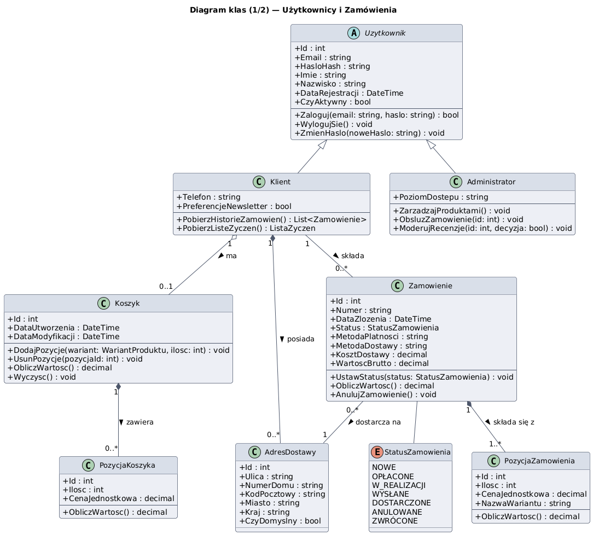

Diagram obejmuje klasy odpowiedzialne za zarządzanie użytkownikami i procesem zakupowym: abstrakcyjną klasę `Uzytkownik` z dziedziczącymi `Klient` i `Administrator`, a także `Koszyk`, `PozycjaKoszyka`, `Zamowienie`, `PozycjaZamowienia`, `AdresDostawy` oraz typ wyliczeniowy `StatusZamowienia`.

#### 5.1.2 Katalog, Recenzje i Zwroty

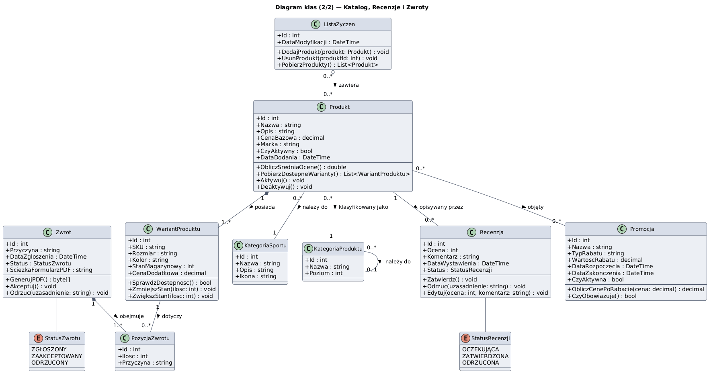

Diagram obejmuje klasy odpowiedzialne za katalog produktów i obsługę posprzedażową: `Produkt`, `WariantProduktu`, `KategoriaSportu`, `KategoriaProduktu`, `ListaZyczen`, `Recenzja`, `Zwrot`, `PozycjaZwrotu`, `Promocja` oraz typy wyliczeniowe `StatusRecenzji` i `StatusZwrotu`.

**Kluczowe aspekty projektowe widoczne na diagramach:**
* **Dziedziczenie (Generalizacja):** Klasy `Klient` oraz `Administrator` dziedziczą po wspólnej klasie abstrakcyjnej `Uzytkownik`, współdzieląc podstawowe dane dostępowe (email, hasło).
* **Silne powiązania (Kompozycja):** `Produkt` zarządza cyklem życia swoich obiektów `WariantProduktu` (wariant nie istnieje bez produktu). Podobnie `Zamowienie` trwale posiada swoje `PozycjaZamowienia`, `Koszyk` — `PozycjaKoszyka`, a `Zwrot` — `PozycjaZwrotu`.
* **Słabe powiązania (Agregacja):** `ListaZyczen` agreguje referencje do obiektów klasy `Produkt` — usunięcie listy życzeń nie powoduje usunięcia produktów z bazy sklepu.
* **Typy wyliczeniowe:** `StatusZamowienia`, `StatusRecenzji` i `StatusZwrotu` modelują cykl życia odpowiednich obiektów i stanowią jawny kontrakt między warstwami systemu.

### 5.2 Uporządkowany alfabetycznie wykaz wszystkich klas

#### 5.2.1 Użytkownicy i Zamówienia

**1. Administrator (dziedziczy po: Uzytkownik)**

Opis: Reprezentuje pracownika sklepu posiadającego uprawnienia do zarządzania zawartością systemu, w tym moderacji opinii i zmiany statusów zamówień.

Atrybuty:

* `poziomDostepu : string` – określa szczegółową rolę i zakres uprawnień w panelu administracyjnym.

Metody:

* `moderujRecenzje(r: Recenzja, decyzja: bool) : void` – zatwierdza lub odrzuca recenzję klienta.

* `zmienStatusZamowienia(status: StatusZamowienia) : void` – aktualizuje etap procesu realizacji zamówienia.

**2. AdresDostawy**

Opis: Obiekt strukturalny przechowujący pełne dane adresowe wskazane przez Klienta jako miejsce docelowe dostarczenia przesyłki.

Atrybuty:

* `imie : string, nazwisko : string` – dane osobowe odbiorcy.

* `ulica : string`, `numerDomu : string`, `numerMieszkania : string` – szczegóły        adresowe budynku.

* `kodPocztowy : string`, `miasto : string`, `kraj : string` – dane regionalne.

* `telefonKontaktowy : string` – numer telefonu dla kuriera.

Metody:

* `walidujAdres() : bool` – sprawdza poprawność formatu kodu pocztowego, numeru telefonu oraz kompletność wymaganych pól.

**3. Klient (dziedziczy po: Uzytkownik)**

Opis: Zarejestrowany użytkownik systemu posiadający konto prywatne, uprawniony do składania zamówień, prowadzenia listy życzeń oraz zgłaszania zwrotów.

Atrybuty:

* `imie : string`, `nazwisko : string` – dane osobowe klienta.

* `dataRejestracji : Date` – data utworzenia konta w systemie.

Metody:

* `dodajDoListyZyczen(p: Produkt) : void` – dopisuje dany produkt do listy życzeń klienta.

* `zglosZwrot(z: Zamowienie) : Zwrot` – inicjuje procedurę zwrotu towaru dla dostarczonego zamówienia.

**4. Koszyk**

Opis: Obiekt sesyjny przechowujący tymczasową listę wariantów produktów wybranych przez Gościa lub Klienta przed przejściem do procesu zakupu.

Atrybuty:

* `idSesji : string` – unikalny identyfikator powiązany z przeglądarką użytkownika.

* `dataUtworzenia : Date` – znacznik czasu utworzenia koszyka.

Metody:

* `dodajPozycje(w: WariantProduktu, ilosc: int) : void` – dodaje wariant do koszyka lub zwiększa jego ilość.

* `obliczWartosc() : float` – sumuje wartość wszystkich pozycji znajdujących się w koszyku.

* `wyczysc() : void` – usuwa wszystkie pozycje z koszyka po pomyślnym sfinalizowaniu zamówienia.

**5. PozycjaKoszyka**

Opis: Pojedynczy wpis w koszyku, łączący wybrany wariant produktu z jego oczekiwaną liczbą sztuk.

Atrybuty:

* `wariant : WariantProduktu` – referencja do konkretnego wariantu towaru.

* `ilosc : int` – liczba zamówionych sztuk danego wariantu.

Metody:

* `zmienIlosc(nowaIlosc: int) : void` – aktualizuje liczbę sztuk w pozycji koszyka.

* `obliczCenePozycji() : float` – zwraca iloczyn ceny bazowej wariantu (lub promocyjnej) i jego ilości.

**6. PozycjaZamowienia**

Opis: Utrwalona pozycja w złożonym zamówieniu, zawierająca historyczną cenę zakupu, odporną na późniejsze zmiany w katalogu produktów.

Atrybuty:

* `wariant : WariantProduktu` – powiązany wariant produktu.

* `ilosc : int` – zakupiona liczba sztuk.

* `cenaZakupu : float` – cena jednostkowa brutto zablokowana w momencie zatwierdzenia checkoutu.

Metody:

* `ObliczWartosc() : decimal` - klasa pełni rolę obiektu reprezentującego dane — Value Object

**7. StatusZamowienia (typ wyliczeniowy)**

Opis: Słownik dopuszczalnych stanów, w jakich może znajdować się zamówienie w swoim cyklu życia.

* Wartości: NOWE, OPLACONE, W_REALIZACJI, WYSLANE, DOSTARCZONE, ANULOWANE, ZWROCONE.

**8. Uzytkownik (klasa abstrakcyjna)**

Opis: Klasa bazowa definiująca wspólne cechy i mechanizmy uwierzytelniania dla wszystkich zalogowanych osób w systemie.

Atrybuty:

* `idUzytkownika : int` – unikalny klucz główny użytkownika.

* `email : string` – unikalny adres poczty elektronicznej, służący jako login.

* `hasloHash : string` – zabezpieczony (zahaszowany) ciąg znaków hasła.

Metody:

* `zaloguj(haslo: string) : bool` – weryfikuje podane hasło z hashem zapisanym w bazie danych.

* `zmienHaslo(noweHaslo: string) : void` – generuje nowy hash dla wprowadzonego hasła i zapisuje go w profilu.

**9. Zamowienie**

Opis: Klasa encyjna reprezentująca zawartą umowę kupna-sprzedaży pomiędzy klientem a sklepem, zawierająca komplet informacji transakcyjnych.

Atrybuty:

* `numerZamowienia : string` – unikalny identyfikator biznesowy w formacie DK-{rok}-{numer}.

* `dataZlozenia : Date` – dokładny termin zatwierdzenia zakupu.

* `wartoscZamowienia : float` – łączny koszt produktów wraz z wliczonym kosztem dostawy.

* `status : StatusZamowienia` – bieżący etap realizacji umowy.

* `metodaPlatnosci : string` – wybrany kanał płatności (np. BLIK, karta, pobranie).

Metody:

* `dodajPozycje(p: PozycjaZamowienia) : void` – dołącza nową pozycję towarową do zamówienia.

* `ustawStatus(nowyStatus: StatusZamowienia) : void` – modyfikuje status zamówienia i wyzwala powiązane zdarzenia systemowe.

* `sprawdzTerminZwrotu() : bool` – weryfikuje, czy od dnia zmiany statusu na DOSTARCZONE nie minęło więcej niż 14 dni.

#### 5.2.2 Katalog,Recenzje i Zwroty

**1. KategoriaProduktu**

Opis: Klasa modelująca hierarchiczną strukturę asortymentu w sklepie (np. Odzież -> Koszulki).

Atrybuty:

* `idKategorii : int` – klucz główny kategorii.

* `nazwa : string` – nazwa wyświetlana w menu (np. "Obuwie").

* `idKategoriiNadrzednej : int` – wskaźnik na kategorię wyższego poziomu, umożliwiający tworzenie drzewiastej struktury.

Metody:

* `pobierzPodkategorie() : List<KategoriaProduktu>` – wyszukuje i zwraca listę wszystkich bezpośrednich podkategorii.

**2. KategoriaSportu**

Opis: Służy do kategoryzowania produktów pod kątem dyscyplin sportowych w celu ułatwienia filtrowania katalogu.

Atrybuty:

* `idSportu : int` – identyfikator dyscypliny.

* `nazwa : string` – nazwa dyscypliny sportowej (np. "Kolarstwo", "Fitness").

Metody:

* brak specyficznych metod (klasa zarządzana bezpośrednio z poziomu serwisu katalogu).

**3. ListaZyczen**

Opis: Agregat przechowujący spis produktów zapisanych przez Klienta w celu późniejszego rozważenia zakupu.

Atrybuty:

* `idListy : int` – unikalny klucz listy.

* `dataAktualizacji : Date` – data ostatniej modyfikacji listy.

Metody:

* `dodajProdukt(p: Produkt) : void` – umieszcza produkt na liście, pod warunkiem nieprzekroczenia limitu 200 pozycji.

* `usunProdukt(p: Produkt) : void` – usuwa wskazany produkt z listy życzeń klienta.

**4. PozycjaZwrotu**

Opis: Wpis szczegółowy zgłoszenia zwrotu, określający konkretną linię z zamówienia oraz liczbę oddawanych sztuk.

Atrybuty:

* `pozycja : PozycjaZamowienia` – referencja do oryginalnej linii zakupowej.

* `iloscZwracana : int` – deklarowana przez klienta liczba odsyłanych sztuk towaru.

Metody:

* `walidujIlosc() : bool` – weryfikuje, czy deklarowana ilość zwrotu jest większa od zera i nie przekracza liczby zakupionych sztuk.

**5. Produkt**

Opis: Główna encja katalogowa definiująca ogólne i wspólne cechy danego artykułu sportowego oferowanego w sklepie.

Atrybuty:

* `idProduktu : int` – klucz główny produktu.

* `nazwa : string`, `marka : string` – nazwa handlowa oraz producent towaru.

* `opis : string` – szczegółowy opis marketingowy i techniczny.

* `cenaBazowa : float` – wyjściowa cena detaliczna przed nałożeniem promocji.

* `sredniaOcena : float` – średnia arytmetyczna ocen wyliczona na podstawie zatwierdzonych opinii.

Metody:

* `przeliczSredniaOcene() : float` – przelicza na nowo wartość pola sredniaOcena po dodaniu lub usunięciu recenzji.

**6. Promocja**

Opis: Reprezentuje regułę biznesową czasowego obniżenia ceny bazowej produktów lub całych kategorii.

Atrybuty:

* `nazwa : string` – nazwa akcji marketingowej (np. "Wyprzedaż Zimowa").

* `dataRozpoczecia : Date`, `dataZakonczenia : Date` – ramy czasowe obowiązywania rabatów.

* `procentRabatu : float` – wartość zniżki wyrażona procentowo.

Metody:

* `czyAktywna() : bool` – zwraca wartość logiczną prawda, jeżeli bieżąca data mieści się w widelcu czasu promocji.

**7. Recenzja**

Opis: Pisemna opinia wystawiona produktowi przez Klienta, podlegająca weryfikacji i procesowi moderacji przez Administratora.

Atrybuty:

* `ocena : int` – wartość numeryczna w skali od 1 do 5.

* `komentarz : string` – tekstowa treść opinii (wymagany przedział od 10 do 2000 znaków).

* `dataWystawienia : Date` – data przesłania formularza oceny.

* `status : StatusRecenzji` – bieżący stan widoczności opinii w systemie.

Metody:

* `ustawStatus(nowyStatus: StatusRecenzji) : void` – zmienia stan recenzji (np. z oczekującej na zatwierdzoną).

**8. StatusRecenzji (typ wyliczeniowy)**

Opis: Zbiór stanów opisujących cykl życia wystawionej opinii w procesie moderacji.

* Wartości: OCZEKUJACA, ZATWIERDZONA, ODRZUCONA.

**9. StatusZwrotu (typ wyliczeniowy)**

Opis: Słownik pojęć określający status weryfikacji i obsługi zgłoszenia zwrotu towaru.

* Wartości: OCZEKUJACY, ZAAKCEPTOWANY, ODRZUCONY, ZAKONCZONY.

**10. WariantProduktu**

Opis: Konkretna i fizyczna odmiana produktu (np. dany rozmiar i kolor), posiadająca własny stan magazynowy oraz unikalny kod identyfikacyjny.

Atrybuty:

* `SKU : string` – unikalny alfanumeryczny identyfikator magazynowy wariantu.

* `rozmiar : string`, `kolor : string`, `plec : string` – cechy fizyczne wariantu.

* `stanMagazynowy : int` – aktualna liczba sztuk fizycznie dostępnych w magazynie.

Metody:

* `zmniejszStan(ilosc: int) : void` – redukuje ilość sztuk na magazynie po zakupie.

* `zwiekszStan(ilosc: int) : void` – zwiększa dostępność towaru po udanym zwrocie od klienta.

* `czyDostepny(wymaganaIlosc: int) : bool` – sprawdza, czy stan magazynowy pozwala na zamówienie żądanej liczby sztuk.

**11. Zwrot**

Opis: Dokumentuje zgłoszenie posprzedażowe klienta wnoszące o odesłanie zakupionych produktów i odzyskanie środków finansowych.

Atrybuty:

* `idZwrotu : int` – unikalny numer identyfikacyjny zgłoszenia.

* `dataZgloszenia : Date` – dzień wprowadzenia formularza przez klienta.

* `przyczyna : string` – uzasadnienie wybrane z listy predefiniowanej.

* `status : StatusZwrotu` – aktualny etap rozpatrywania wniosku.

Metody:

* `generujPDF() : File` – tworzy gotowy dokument formularza zwrotu w formacie PDF do wydrukowania i umieszczenia w paczce zwrotnej.

### 5.3 Diagramy stanów

W celu zobrazowania cyklu życia kluczowych obiektów systemu oraz zmian ich zachowania pod wpływem zdarzeń biznesowych, przygotowaliśmy diagramy stanów dla trzech klas: Zamówienie, Zwrot oraz Recenzja.

#### 5.3.1 Diagram stanów dla klasy Zamówienie

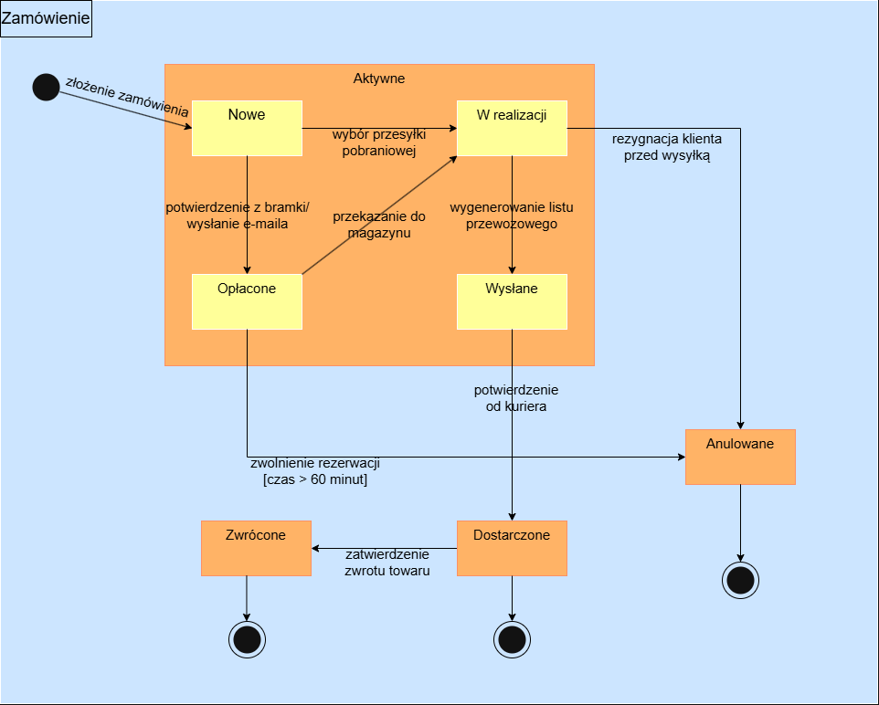

**Wykaz i opis stanów:**

* Stan początkowy (Start): Punkt startowy tworzenia obiektu zamówienia w systemie.

* `Aktywne`: Stan zbiorczy grupujący etapy, w których zamówienie jest procesowane, a towar pozostaje zarezerwowany na magazynie.

* `Nowe`: Zamówienie zostało pomyślnie utworzone przez klienta i oczekuje na autoryzację płatności.

* `Opłacone`: Środki zostały zaksięgowane przez zewnętrzną bramkę płatniczą.

* `W realizacji`: Zamówienie zostało przekazane do magazynu; trwa kompletowanie i pakowanie produktów.

* `Wysłane`: Paczka została oklejona listem przewozowym i przekazana kurierowi.

* `Anulowane`: Stan końcowy, w którym proces został przerwany, a rezerwacja magazynowa zwolniona.

* `Dostarczone`: Stan końcowy oznaczający pomyślny odbiór przesyłki przez klienta.

* `Zwrócone`: Stan końcowy, w który zamówienie przechodzi, jeśli klient skorzysta z ustawowego prawa do zwrotu towaru w ciągu 14 dni.

* Stan końcowy (Stop): Zakończenie cyklu życia obiektu w systemie.

#### 5.3.2 Diagram stanów dla klasy Zwrot

**Wykaz i opis stanów:**

* Stan początkowy (Start): Inicjacja procedury zwrotu.

* `Oczekujący`: Zgłoszenie zostało zarejestrowane. Wpis wewnątrz stanu: entry / wygenerowanie PDF – w momencie wejścia w stan system automatycznie tworzy gotowy dokument formularza zwrotu dla klienta.

* `Zaakceptowany`: Magazynier potwierdził, że odesłany towar jest kompletny i nieuszkodzony.

* `Odrzucony`: Towar nie spełnił kryteriów przyjęcia (uszkodzenia, ślady użytkowania).

* `Zakończony`: Środki finansowe zostały pomyślnie zwrócone klientowi.

* Stan końcowy (Stop): Zamknięcie zgłoszenia w systemie. 

#### 5.3.3 Diagram stanów dla klasy Recenzja

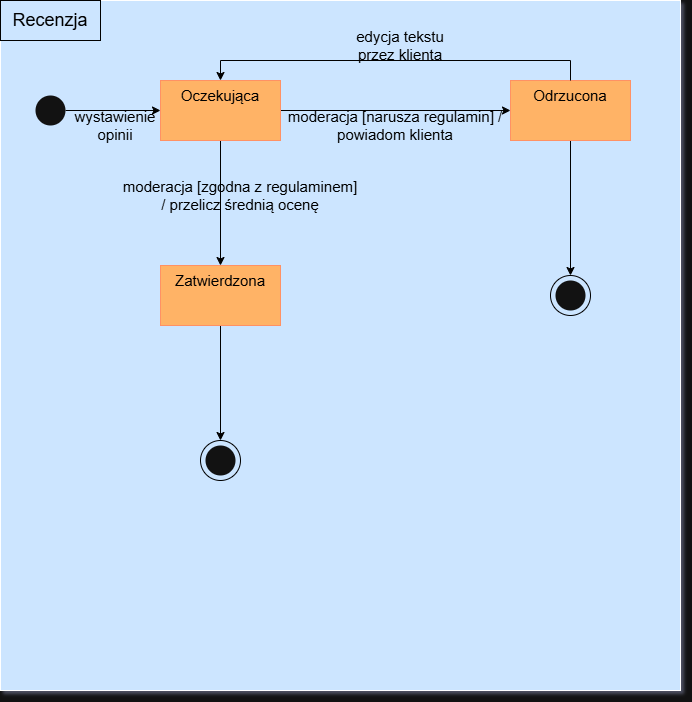

**Wykaz i opis stanów:**

* Stan początkowy (Start): Moment wysłania opinii przez klienta.

* `Oczekująca`: Recenzja jest zapisana w bazie danych, ale pozostaje ukryta dla innych użytkowników na Karcie Produktu.

* `Zatwierdzona`: Opinia spełnia regulamin i jest publicznie widoczna w sklepie.

* `Odrzucona`: Treść narusza regulamin (np. zawiera spam) i została trwale zablokowana.

* Stan końcowy (Stop): Zakończenie cyklu życia (np. usunięcie opinii lub archiwizacja).

### 5.4 Propozycje interfejsu użytkownika

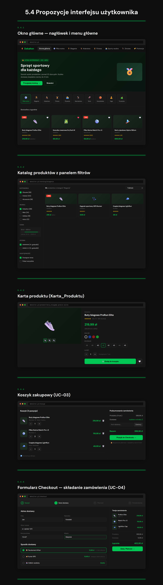
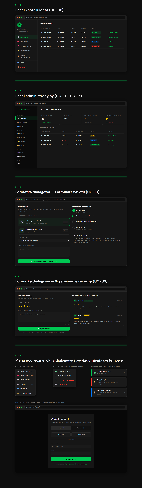

## 6. Wymagania niefunkcjonalne dla systemu

### 6.1 Oszacowanie wielkości bazy danych

Oszacowanie wielkości relacyjnej bazy danych (SQL) przeprowadziliśmy na podstawie przewidywanej skali eksploatacji w pierwszym roku działalności tj.: około 10 000 zarejestrowanych klientów, średnio około 300 zamówień na dobę, co daje około 110 000 zamówień rocznie.

Zakładamy, że system będzie przechowywał pliki binarne takie jak zdjęcia produktów czy wygenerowane formularze PDF ze zwrotami w zewnętrznym magazynie obiektowym, a relacyjna baza danych będzie przechowywać jedynie ścieżki URL do tych plików.

**Szacunkowy przyrost danych strukturalnych (tekstowych i liczbowych) w pierwszym roku:**

* **Klienci i Adresy**: 10 000 klientów $\times$ 2 KB = ~20 MB

* **Katalog** (Produkty, Warianty, Kategorie): ~5 000 produktów $\times$ 4 warianty $\times$ 3 KB = ~60 MB

* **Zamówienia i Pozycje Zamówień**: 110 000 zamówień $\times$ 5 KB (wraz z pozycjami) = ~550 MB

* **Recenzje**: ~20 000 opinii rocznie (na podstawie założenia 30–80 recenzji na dobę) $\times$ 2 KB = ~40 MB

* **Zwroty**: ~11 000 zgłoszeń (przy założeniu wskaźnika zwrotów na poziomie 10%) $\times$ 2 KB = ~22 MB

* **Narzut na indeksy, klucze obce i logi transakcyjne**: + 50%

Podsumowująć sama struktura relacyjna wygeneruje w pierwszym roku ruch rzędu 1–1,5 GB. Biorąc pod uwagę perspektywę 5-letnią oraz konieczność przechowywania danych historycznych, minimalna pojemność serwera relacyjnej bazy danych (bez plików graficznych) na start powinna wynosić 10 GB. Przestrzeń dyskowa na zewnętrzne zasoby binarne (zdjęcia, formularze PDF) powinna wynosić minimum 50 GB.

### 6.2 Propozycja wymaganych czasów odpowiedzi

| # | Rodzaj operacji | Maksymalny czas odpowiedzi | Opis |
|---|-----------|-------------------|------|
| 1 | `Renderowanie Katalogu` | ≤ 2,5 s | Dotyczy metryki Largest Contentful Paint . Wymaga wdrożenia mechanizmów cache'owania. |
| 2 | `Zwracanie wyników wyszukiwania i filtrowania`| ≤ 500 ms | Operacje odczytu (GET) na zapleczu (API) obsługujące dynamiczne zapytania Klientów. |
| 3 | `Operacje na Koszyku` | ≤ 300 ms | Dodawanie, usuwanie i zmiana ilości Wariantów_Produktu; wymaga natychmiastowej reakcji interfejsu. |
| 4 | `Inicjacja Checkoutu i utworzenie Zamówienia` | ≤ 2,0 s | Rezerwacja Stanu_Magazynowego, zapis obiektu Zamówienia do bazy i przygotowanie integracji z Bramką_Płatniczą. |
| 5 | `Generowanie formularza PDF (Zwroty)` | ≤ 30 s | Złożona operacja I/O realizowana po stronie serwera po zgłoszeniu Zwrotu przez Klienta. |
| 6 | `Raportowanie (Panel Administratora)` | ≤ 5,0 s | Ciężkie zapytania analityczne operujące na tysiącach rekordów Zamówień, realizowane wyłącznie dla Administratorów. |

### 6.3 Oszacowanie liczby i typów potrzebnych stanowisk pracy użytkowników systemu

**1. Stanowiska dla Klientów i Gości (Użytkownicy zewnętrzni)**

* **Liczba stanowisk**: Zmienna i nieograniczona, szacowana na ok. 10 000 aktywnych użytkowników rocznie.

* **Typ stanowiska**: Prywatne urządzenia użytkowników z dostępem do internetu – w równej mierze komputery osobiste (PC/Mac) oraz urządzenia mobilne (smartfony, tablety). System musi być w pełni responsywny.

**2. Stanowiska dla Administratorów (Użytkownicy wewnętrzni)**

* **Liczba stanowisk**: 2 do 5 stanowisk, obsługiwanych rotacyjnie w ramach czasu pracy zespołu obsługi sklepu.

* **Typ stanowiska**: Standardowe komputery biurowe (PC/Laptop) podłączone do stabilnej sieci internetowej, wyposażone w monitory. Nie są wymagane maszyny o wysokiej mocy obliczeniowej.

* **Dodatkowe urządzenia**: Zwykła drukarka biurowa / drukarka etykiet kurierskich do procesowania zamówień ze statusem "W realizacji".

## 7.Propozycja technologii informatycznych, które mogą zostać wykorzystane do realizacji systemu

### 7.1 diagram wdrożenia

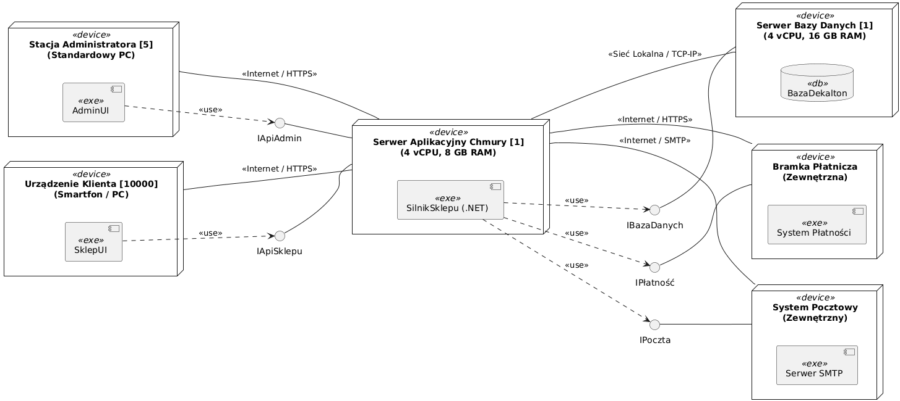

## 8.Propozycja planu pracy

| ID | Nazwa etapu (realizowany komponent) | Czas trwania (dni robocze) | Zależności (wymaga zakończenia) | Przypisane zasoby ludzkie |
|---|-----------|-------------------|------|------|
| E1 | **Projekt techniczny i architektura bazodanowa** (Model ERD, diagramy klas, makiety UI) | 5 dni | Brak (etap początkowy) | Kacper S., Kacper H., Szymon N. |
| E2 | **Konfiguracja środowiska i repozytorium** (Setup bazy danych, szkielet projektowy, CI/CD) | 3 dni | E1 | Kacper S. |
| E3 | **Back-end: Moduł Katalogu i Użytkowników** (Zarządzanie produktami, wariantami, autoryzacja, konta) | 10 dni | E2 | Kacper H. |
| E4 | **Front-end: Interfejs Klienta (Sklep)** (Widoki katalogu, karta produktu, wyszukiwarka) | 12 dni | E1 (może być robione równolegle z E2 i E3) | Szymon N.|
| E5 | **Back-end: Logika Koszyka, Zamówień i Zwrotów** (Serwisy biznesowe, walidacja stanów magazynowych) | 12 dni | E3 | Kacper H. |
| E6 | **Integracje Zewnętrzne** (Podpięcie Bramki Płatniczej i Systemu Pocztowego API) | 7 dni | E5 | Kacper S. |
| E7 | **Front-end: Panel Administratora** (Zarządzanie zamówieniami, moderacja recenzji, zwroty) | 10 dni | E3 | Szymon N. |
| E8 | **Testy systemowe i poprawki (QA)** (Testy integracyjne E2E, walidacja ścieżki zakupowej checkoutu) | 8 dni | E4, E6, E7 | Kacper S., Kacper H., Szymon N. |
| E9 | **Wdrożenie i dokumentacja** (Publikacja na serwerze produkcyjnym, instrukcja obsługi) | 4 dni | E8 | Kacper S., Kacper H., Szymon N. |

## 9.Analiza ryzyka projektu zawierająca wykaz przewidywanych zagrożeń

| ID | Zidentyfikowane zagrożenie | Prawdopodobieństwo | Stopień szkodliwości | Propozycje metod zapobiegania | Plan awaryjny w przypadku wystąpienia
|---|-----------|--------------|------|------|--------------------------|
| R1 | **Niedostępność API zewnętrznej Bramki_Płatniczej podczas Checkoutu** (np. awaria po stronie operatora płatności) | Średnie | Duży | Izolacja logiki płatności za pomocą wzorca projektowego. Wdrożenie mechanizmu timeout na zapytania sieciowe, aby nie blokować aplikacji. | System automatycznie ukrywa niedostępną metodę płatności i wyświetla komunikat. Klient może sfinalizować transakcję wybierając "płatność przy odbiorze", co pozwala utrzymać sprzedaż. |
| R2 | **Niespójność stanów magazynowych przy spiętrzeniach ruchu** (Dwóch klientów kupuje ostatnią sztukę tego samego Wariantu_Produktu podczas wyprzedaży) | Średnie | Średni | Zastosowanie transakcji bazodanowych z odpowiednim poziomem izolacji. Wdrożenie w Koszyku mechanizmu tymczasowej rezerwacji Stanu_Magazynowego na czas Checkoutu (np. na 60 minut). | Ręczne anulowanie jednego z zamówień przez Administratora. Wysłanie e-maila z przeprosinami i rekompensatą w postaci wygenerowanego Kuponu_Rabatowego na kolejne zakupy. |
| R3 | **Znaczne opóźnienia w integracji warstwy Front-end z Back-endem** (Wynikające z równoległej pracy różnych członków zespołu) | Duże | Duży | Wczesne zdefiniowanie i "zamrożenie" kontraktów API. Regularne spotkania synchronizacyjne zespołu programistycznego. | Zmniejszenie zakresu projektu przed oddaniem. Odłożenie modułów opcjonalnych na rzecz dopracowania krytycznej ścieżki zakupowej (Katalog $\rightarrow$ Koszyk $\rightarrow$ Zamówienie). |
| R4 | **Spadek wydajności aplikacji przy docelowym ruchu** (Czas wczytania strony LCP przekracza założone 2,5 s) | Średnie | Mały | Zastosowanie paginacji dla wyników wyszukiwania Produktów. Optymalizacja rozmiaru ładowanych zdjęć w warstwie UI. Konfiguracja indeksów na tabelach bazodanowych. | Wdrożenie prostego mechanizmu cache'owania pamięci podręcznej dla najczęściej odwiedzanych Kategorii_Sportu lub szybkie dokupienie RAM/CPU na okres szczytu. |